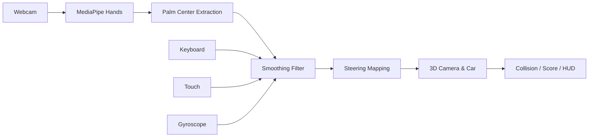

<div align="center">


<h1>
  
  &nbsp;GestureKart AI Racing
</h1>

<p><strong>AI Gesture-Controlled Racing — Steer With Your Hands, No Controller Needed</strong></p>

<p>
  <a href="https://car--raceing.vercel.app">
    
  </a>
</p>

<p>
  
  
  
  
  
</p>

<p>
  
  
  
  
</p>

<br/>

<p>
  <a href="#-games-included">Games</a> ·
  <a href="#-features">Features</a> ·
  <a href="#-how-it-works">How It Works</a> ·
  <a href="#-system-architecture">Architecture</a> ·
  <a href="#-tech-stack">Tech Stack</a> ·
  <a href="#-getting-started">Getting Started</a>
</p>

</div>

---

**GestureKart AI Racing** is a browser racing experience with a twist: **your hands are the steering wheel**. Two games in one — a 3D night-drive racing sim controlled entirely by webcam hand gestures, plus a classic arcade Kart Racing mode. Built with **Three.js** for 3D rendering and **MediaPipe Hands** for real-time hand tracking.

Race through a neon-lit cyberpunk tunnel at 60 FPS — or fall back to keyboard, touch, or even phone gyroscope controls on any device.

---

## 🏎️ Games Included

| Mode | Description | Controls |
|------|-------------|----------|
| **Virtual Steering** | 3D first-person racer through a neon tunnel with HUD, speed gauge, gearbox, and obstacle traffic | Hands (webcam) · Keyboard · Touch |
| **Kart Racing** | Fast-paced arcade kart racer with its own menu, tracks, and gameplay loop | Keyboard · Touch |

---

## ✨ Features

### 🖐️ Hand-Gesture Steering (Flagship)
- **Drive with both hands** — car accelerates when both hands are detected; palms mapped to steering angle
- **Smooth tracking** — exponential landmark smoothing + dead zone + non-linear steering curve for natural feel
- **Live camera panel** — see your hand skeleton overlay while you play

### 🎮 Multi-Input System
- **Keyboard** — `W` gas · `A`/`D` steer · `U` auto-accelerate
- **Touch controls** — on-screen buttons for mobile play
- **Gyroscope mode** — tilt your phone to steer
- **Auto-accelerate** — toggle for hands-free gas

### 🎨 Game Systems
- **3D cockpit** — dashboard, gauges, steering wheel with real-time rotation, mirrors, windshield
- **Obstacle traffic** — AI cars to dodge; collisions end the race with screen shake
- **Race timer & score** — 90-second race, lap tracking, position, and final results screen
- **Procedural engine audio** — Web Audio API synth engine sound scaled to speed
- **Speed lines & vignette** — dynamic juice effects at high velocity
- **Sensitivity calibration** — adjustable steering sensitivity and smoothing

---

## 🕹️ How It Works



1. MediaPipe extracts 21 hand landmarks per frame (up to 2 hands)
2. The palm center (wrist + index + middle MCP) is mapped to a 0–1 steering axis
3. Exponential smoothing removes jitter; a dead zone prevents drift
4. The steering axis drives the 3D camera, cockpit, and headlights in Three.js

---

## 🏗️ System Architecture

```
src/
├── main.ts                 # Entry point: UI, menu flow, game loop
├── game/
│   └── Game.ts             # Three.js scene, physics, collisions, HUD state
├── input/
│   ├── HandTracker.ts      # MediaPipe hand pipeline + steering mapping
│   └── Keyboard.ts         # Keyboard state handler
├── utils/
│   └── smoothing.ts        # Exponential moving-average filter
└── style.css               # Full UI styling (HUD, panels, overlays)

public/
└── kart-racing/            # Kart Racing arcade game (standalone page)
```

**Design principles:** the hand tracker is input-agnostic — keyboard, touch, and gyro overrides plug into the same steering pipeline.

---

## 🧰 Tech Stack

| Layer | Technology |
|-------|-----------|
| Language | TypeScript |
| 3D Rendering | Three.js · WebGL |
| Vision AI | MediaPipe Hands |
| Build | Vite |
| Audio | Web Audio API (procedural) |
| Deployment | Vercel |

---

## 🚀 Getting Started

### Prerequisites
- Node.js 18+
- A webcam (for hand tracking)

### Installation

```bash
# 1. Clone & install
git clone https://github.com/Manthan-13521/GestureKart-AI-Racing.git
cd GestureKart-AI-Racing
npm install

# 2. Run the dev server
npm run dev

# 3. Open the game
# http://localhost:5173
```

### Scripts

| Script | Description |
|--------|-------------|
| `npm run dev` | Start the Vite dev server |
| `npm run build` | Type-check + production build |
| `npm run preview` | Preview the production build |

---

## 🔭 Roadmap

- [ ] Multi-track selection & lap racing
- [ ] Leaderboards (local + online)
- [ ] Gesture calibration screen
- [ ] Two-hand asymmetric steering (gas + steer)
- [ ] Mobile PWA install support

---

## 🤝 Contributing

Contributions, issues, and feature requests are welcome. Fork the repo, make your change, and open a pull request.

---

## 📄 License

All rights reserved.

---

<div align="center">

**© 2026 Manthan Jaiswal** — Built with Three.js, MediaPipe & TypeScript.

<br/>

<a href="https://car--raceing.vercel.app">🏎️ Play GestureKart</a>

</div>
